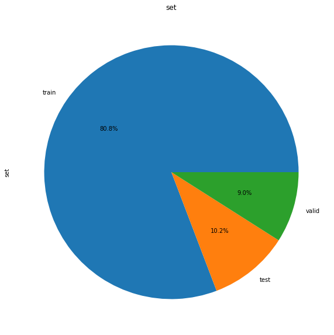

# Introducción

# **Sección 1. Análisis Exploratorio de los datos (1,5 puntos)**

Realizar un análisis exploratorio de los datos proporcionados, tanto en formato numérico como gráfico, donde se recoja la información relevante del conjunto de datos proporcionado.

De forma esquématica:
* 10 carpetas
* Cada carpeta con 3 subcarpetas descritas como train, test y valid
* Cada subcarpeta con 2 subcarpetas descritas como normal y abnormal.

Se ha agrupado todo ello en un dataframe que ofrece los siguientes resultados:

          17070 rows × 5 columns

          Train: 13790 imágenes
          Test: 1740 imágenes
          Valid: 1540 imágenes

          En test 919 mormal y 821 abnormal
          En train 7452 normal y 6338 abnormal
          En valid 819 normal y 721 abnormal

De forma gráfica: 
 

 

Mostramos las imágenes sin glaucoma y con glaucoma  
Sin glaucoma:  
  
Con Glaucoma:  

Detalle de las imágenes
Clipping input data to the valid range for imshow with RGB data ([0..1] for floats or [0..255] for integers).

JPEG    RGB    (224, 224)  
Mean: 114.685  Min: 7.000, Max: 255.000
Mean: 0.000    Min: -107.685, Max: 140.315
Data Type: float64    Min: -107.685, Max: 140.315
pixel mean =  -4.2828168e-09   Min: -0.422, Max: 0.550

# **Sección 2. Entrenamiento de una red neuronal sobre una única partición (4 puntos)**

Consideraciones que se han tomado tras haber realizado y realizado toda esta sección:
* He fijaco el número de épocas totales aunque se aplicado el Early Stopping, ya que el Learning Rate variará en función de las épocas que le habíamos indicado como objetivo final.
* Normalmente los hiperparámetros determinados en un inicio, se suelen transferir bien a otros y la mejora que obtendría en volver a optimizarlos, sería mínima.
* Aunque la teoría indica que hay que optimizar todos los hiperparámateros cada vez que se realiza un entrenamiento.. en muchos artículos se indica que la experiencia ha demostrado el impacto significativo que puede tener unos sobre los resultados y cuáles no.

* Para la realización de este apartado se han realizado multiples entrenamiento y validaciones con multiples parámetros y despues de revisar los resultados se ha selecionado los siguientes parámetros:
* Epoch: 80
* Batch: 32
* Learning Rate: 0.001
* Optimizador: 'Adam'
* Loss: categorical_crossentropy
* Metríca F1-Score

Estos parámetros se obtenido con el Modelo 1.

Si bien se indica en la guia: "Las capturas de pantalla (por ejemplo, las gráficas de rendimiento) o los fragmentos de código (si se consideran relevantes) deben estar pensados para ilustrar y no para ser protagonistas." en mi caso derivo lo relevante al código y al archivo anexo llamado PRA_Oscar_Rojo_27 y aquí los pantallazos y gŕaficas son meramente ilustrativos.

En todos ellos plasmamos el Summary, 

## Modelo 1

    Classification Report
              precision    recall  f1-score   support

    abnormal        0.82      0.70      0.75        92
    normal          0.71      0.83      0.76        82

    accuracy                            0.76       174
    macro avg       0.76      0.76      0.76       174
    weighted avg    0.77      0.76      0.76       174

 

## Modelo 2

    Classification Report
              precision    recall  f1-score   support

    abnormal       0.53      0.99      0.69        92
      normal       0.00      0.00      0.00        82

    accuracy                           0.52       174
    macro avg      0.26      0.49      0.34       174
    weighted avg   0.28      0.52      0.36       174

 

## Modelo 3

    Classification Report
              precision    recall  f1-score   support

    abnormal       0.56      0.34      0.42        92
      normal       0.49      0.71      0.58        82

    accuracy                           0.51       174
    macro avg      0.53      0.52      0.50       174
    weighted avg   0.53      0.51      0.49       174

 

## Modelo 4

    Classification Report
              precision    recall  f1-score   support

    abnormal       0.91      0.79      0.85        92
      normal       0.80      0.91      0.85        82

    accuracy                           0.85       174
    macro avg      0.86      0.85      0.85       174
    weighted avg   0.86      0.85      0.85       174

 

## Modelo 5

    Classification Report
              precision    recall  f1-score   support

    abnormal       0.83      0.64      0.72        92
      normal       0.68      0.85      0.76        82

    accuracy                           0.74       174
    macro avg      0.76      0.75      0.74       174
    weighted avg   0.76      0.74      0.74       174

 

# **Sección 3. Validación cruzada y discusión (3 puntos)**

Para esta opción se ha estado valorando esto:

1- Un bucle de folds y por cada uno crear un modelo, generator, fit, evaluarlo y obtener su F1-score. Así hasta recorrer todos loa folds y obtendremos 10 valores de F1 score de tests distintos cada uno. Calculamos valor medio y desviación estándar y listo, finiquitado.

2- Lo mismo pero añadiendo otro bucle dentro para por cada modelo creado entrenarlo con cada fold excepto el actual y luego evaluarlo con el test del fold actual. Te quedarían para un mismo test 10 F1Score que tendrías que calcular el valor medio y sacar el F1Score medio para ese fold del test. Así con cada fold hasta recorrer todos y al final calculamos el valor medio y desviación estándar de los 10 F1-Score medios de test de cada fold que nos han quedado.

Pensando en ello y en lo puesto en el enunciado, he aplicado la primera opción.

POr otro lado en el CV se debía de entrenar 10 modelos desde 0 (o con e transfer learning de los pesos cargados de imagenet), con las siguientes aproximaciones:
1. Entrenar desde los pesos cargados de imagenet o con pesos random inicializados.
2. El considerar un modelo derivado de otro. En este caso para cada CV habría que enternara, para cada fold, primero el modelo con las capas congeladas y luego reentrenar el modelo de nuevo con capas descongeladas que se hayan consderado. 

Este última opción se podría comprobar que no tienen ventajas con respecto a la primera opción y si bastantes desventajas computacionales.

Tras haber evaluado 5 modelos, he considerado seleccionar el modelo 1 como el mejor y el que mejor resultado ofrece.

Con ello y para cada fold, he aplicado dicho modelo para cada fold de forma independiente. En este primer modelo, todas las capas son congeladas salvo la última con los pesos preentrenados de imagenet, he entrenado desde 0 esa configuración.

En lineas generales cada uno de los fold ha dado unos resultado muy cercanos.

Destaco los fold 8 con una accuracy del 79%, seguido de los fold 3,4, y con un accuracy del 78%

Centrandome en el fold 8, con una Matriz de Confusión de la siguiente forma:

# **Sección 4. Análisis crítico (1,5 puntos)**

Contesta, de forma razonada y justificada, a las siguientes preguntas:

  a) Para la realización de la práctica se han entregado las *folds* preparadas para el entrenamiento.

        i) Indicar qué estrategia de diseño hubieras seguido si las hubieras tenido que definir tú.

<b>Me parece que ha sido adecuada la estrategia de diseño elegida y aplicada, porque cargar todas las imágenes en memoria requeriría de gran candidad de recursos y al tener la imágenes separadas en carpetas se presupone como la más optima.

POr otro lado el uso de la función flow_from_directory carga un tren de imágenes que evitan colapsar a memoria.

Aquí hemos visto que la distribución de las imágenes entre las 10 carpetas - ver <i>sección 3</i>- es práctimanete la misma, con la misma cantidad de imágenes de entrenamiento, de test y de validación.</b>

        ii) Indicar qué puntos son importantes en el diseño de estas particiones para que los modelos resultantes tengan una buena capacidad de generalización.

<b>Sobre todo el reparto de las imágenes en grupos homogeneos, con el fin de evitar el colapso de los procesos de entrenamiento.</b>

b) Realizar un análisis crítico de los resultados obtenidos y las conclusiones a las que has llegado después de realizar esta práctica.

<b>En este punto podemos indicar las siguientes conclusiones.

  * A pesar de contar con equipos locales con GPU y capacidad de proceso.... los tiempos de ejecución ha sido extremadamente largos y ha conllevado una gran cantidad de pruebas,.... muchas de ellas infructuosas.

  * A requerido de utilizar medios onerosos y en algunas ocasiones poco efectivos... el computo total de horas, no solo de proceso, sino de prueba y error... en mi caso ha llevado a más de 100 horas.

  * Consultado el resultado de las pruebas al médico con el que vivo (Ginecologo-Retirado), me indica que en este caso... lo más preocupante es la gran cantidad de Falsos negatios que se obtienen de los procesos de evaluación. En el caso de los obtenidos en la sección 3... los porcentajes por Fold varian entre el 6% y el 14 %". Es por ello que la clave en este tipo de estudios es reducir al máximo los diagnosticos incorrectos a un paciente que tiene realmente un problema.

  * Por último: Las mayores frecuencias de respuestas falsas negativas en los ojos con pérdida de campo estaban fuertemente asociadas con el estado del campo. Las mayores frecuencias de falsos negativos en los ojos con pérdida de campo glaucomatosa en comparación con los ojos no afectados pueden explicarse por la mayor variabilidad de los valores umbrales que se suele encontrar en dichos ojos. Por lo tanto, las respuestas falsas negativas en pacientes con glaucoma representan el estado del ojo más que el del paciente.
  </b>

# Referencias:

* CNN Explainer. (s. f.). CNN Explainer. https://poloclub.github.io/cnn-explainer/

* Radečić, D. (2022a, enero 4). How to Optimize Learning Rate with TensorFlow — It’s Easier Than You Think. Medium. https://towardsdatascience.com/how-to-optimize-learning-rate-with-tensorflow-its-easier-than-you-think-164f980a7c7b

* Radečić, D. (2022b, enero 4). How to Optimize Learning Rate with TensorFlow — It’s Easier Than You Think. Medium. https://towardsdatascience.com/how-to-optimize-learning-rate-with-tensorflow-its-easier-than-you-think-164f980a7c7b
  
* Save and load models | TensorFlow Core. (s. f.). TensorFlow. https://www.tensorflow.org/tutorials/keras/save_and_load
  
* Team, K. (s. f.-a). Keras documentation: Keras Applications. Https://Keras.Io/Api/Applications/. https://keras.io/api/applications/
  
* Team, K. (s. f.-b). Keras documentation: Transfer learning & fine-tuning. Https://Keras.Io/Guides/Transfer_learning/. https://keras.io/guides/transfer_learning/
  
* TensorFlow Addons. (s. f.). TensorFlow. https://www.tensorflow.org/addons
  
* tfa.metrics.F1Score | TensorFlow Addons. (s. f.). TensorFlow. https://www.tensorflow.org/addons/api_docs/python/tfa/metrics/F1Score
  
* Torres, J. (s. f.). GitHub - jorditorresBCN/Deep-Learning-Introduccion-practica-con-Keras: Github del libro Deep Learning - Introducción práctica con Keras. GitHub. https://github.com/jorditorresBCN/Deep-Learning-Introduccion-practica-con-Keras
  
* Tutorial image classification with keras flow from directory and generators. (s. f.). Tutorial image classification with keras flow from directory and generators. https://vijayabhaskar96.medium.com/tutorial-image-classification-with-keras-flow-from-directory-and-generators-95f75ebe5720
  
* Brownlee, J. (2019, 5 julio). How to Configure Image Data Augmentation in Keras. Machine Learning Mastery. https://machinelearningmastery.com/how-to-configure-image-data-augmentation-when-training-deep-learning-neural-networks/

* Cómo tomar fotos del fondo de ojo con tu celular. (2017, 18 abril). YouTube. https://www.youtube.com/watch?v=KAoCBditsoY

* Bengtsson, B. (2000, 1 julio). False-Negative Responses in Glaucoma Perimetry: Indicators of Patient Performance or Test Reliability? | IOVS | ARVO Journals. False-Negative Responses in Glaucoma Perimetry. https://iovs.arvojournals.org/article.aspx?articleid=2123679

* Lau, S. (2018, 20 junio). Learning Rate Schedules and Adaptive Learning Rate Methods for Deep Learning. Medium. https://towardsdatascience.com/learning-rate-schedules-and-adaptive-learning-rate-methods-for-deep-learning-2c8f433990d1